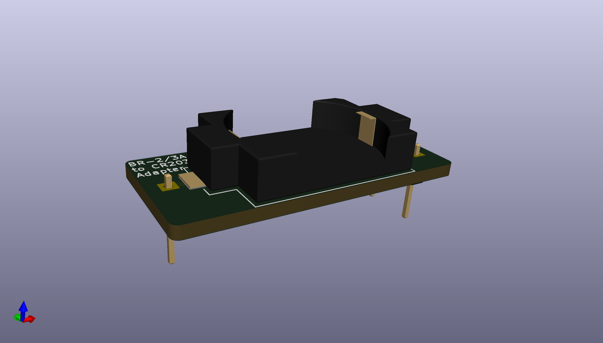
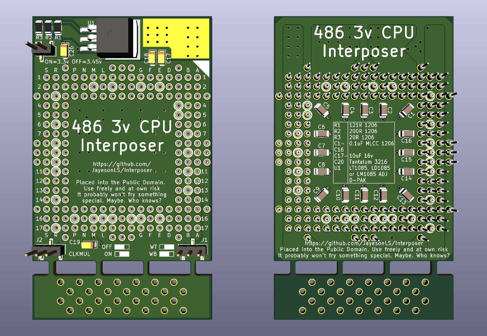

# AdatpterBoards
Various designs for adapter boards. Unless otherwise specificed, 
these designes are all placed into the Public Domain. See LICENSE
for more details.

Battery BR-2/3A to CR2032
-------------------------

**STATUS:** Untested.

Allows use of a CR2032 in place of a Panasonic BR-2/3A, as used
in some PS/2's.

Interposer 486 3V
-----------------

**STATUS:** Untested. Assembling will be complicated - instructions to follow. 

Allows a 3V 486 CPU to be used on mainboards with only 5V CPU support.
Jumpers allow selection of:

* CLKMUL selection supported by some CPUs.
* Selecting between write-back or write-through cache.
  Not all CPUs or motherboards support write-back cache.
* CPU voltage of 3.3v or 3.45v.

5V power to the interposer board can be provided externally, or, through the
otherwise unused outer ring of pins available on Socket 2 and Socket 3. 
